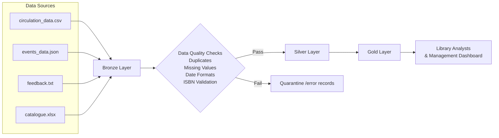

# Add your architecture diagrams here

```mermaid
flowchart LR

    subgraph Source["Data Sources"]
        Source1[circulation_data.csv]
        Source2[events_data.json]
        Source3[feedback.txt]
        Source4[catalogue.xlsx]
    end

    Bronze[Bronze Layer]

    Source1 --> Bronze
    Source2 --> Bronze
    Source3 --> Bronze
    Source4 --> Bronze

    Check{"Data Quality Checks
    Duplicates
    Missing Values
    Date Formats
    ISBN Validation"}

    Bronze --> Check

    Check -->|Pass| Silver[Silver Layer]
    Check -->|Fail| Quarantine[Quarantine /error records]

    Silver --> Gold[Gold Layer]

    Gold --> Dashboard["Library Analysts
    & Management Dashboard"]
```
