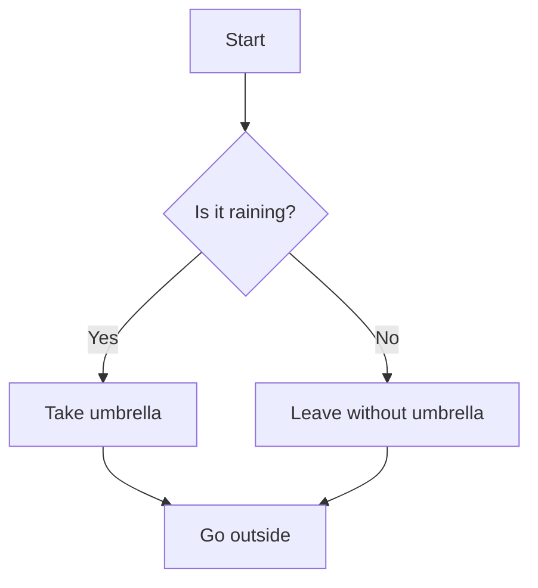

# Pipeline Architecture Diagram

```mermaid
flowchart TD
    A[Start] --> B{Is it raining?}
    B -->|Yes| C[Take umbrella]
    B -->|No| D[Leave without umbrella]
    C --> E[Go outside]
    D --> E[Go outside]
```